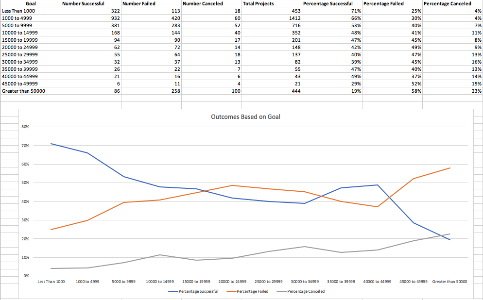

# Kickstart My Chart

## Background

Over $2 billion has been raised using the massively successful crowdfunding service, Kickstarter, but not every project has found success. Of the more than 300,000 projects launched on Kickstarter, only a third have made it through the funding process with a positive outcome.

Getting funded on Kickstarter requires meeting or exceeding the project's initial goal, so many organizations spend months looking through past projects in an attempt to discover some trick for finding success. This project organized and analyzed a database of 4,000 past projects in order to uncover any hidden trends.

## Conclusions

* There is an extremely high percentage of theatre campaigns in this dataset compared to other categories, specifically plays.
* Campaign funding drops significantly in December per this dataset. One factor to consider may be a correlation between Holiday spending and campaign funding.
* In this dataset, campaigns with lower goals have a higher chance of success funding. Successful campaign funding trends downward the higher the goal.

## Limitations
This dataset does not include all campaigns during the time span of the sample. We are not told what criteria was used for selecting these campaigns so we cannot be certain the analysis will be accurate. The criteria could explain the high number of theatre campaigns in the dataset.

## Screenshots

